My graduation project 😃, it is the first project among 15 project. 
# Enzyme-classification
Protein(Enzyme, graph) classification with active learning sitting 

# Active Learning Framework
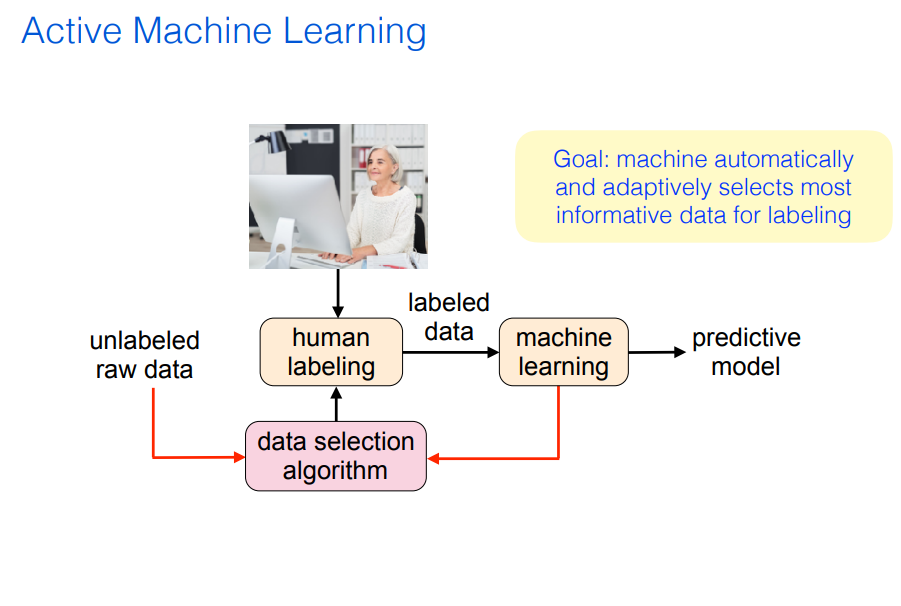

# Some graph data from dataset

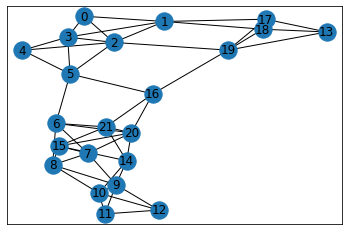
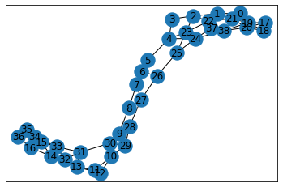
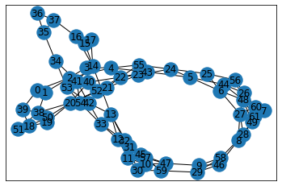
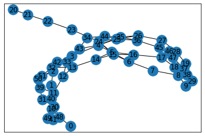
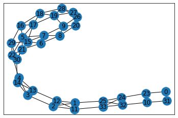
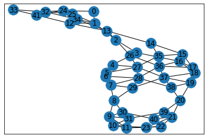
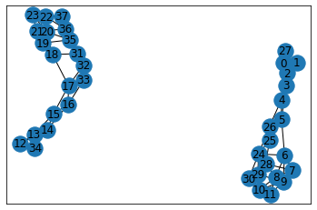
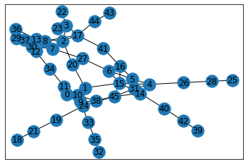
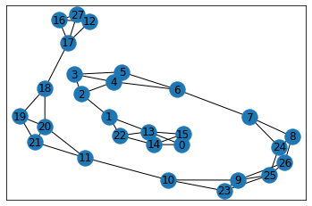
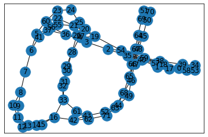
